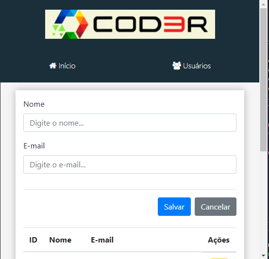
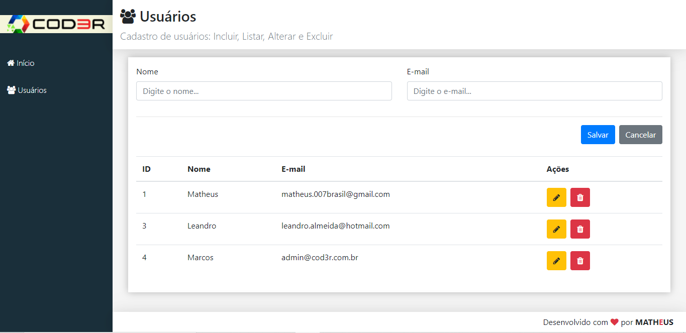
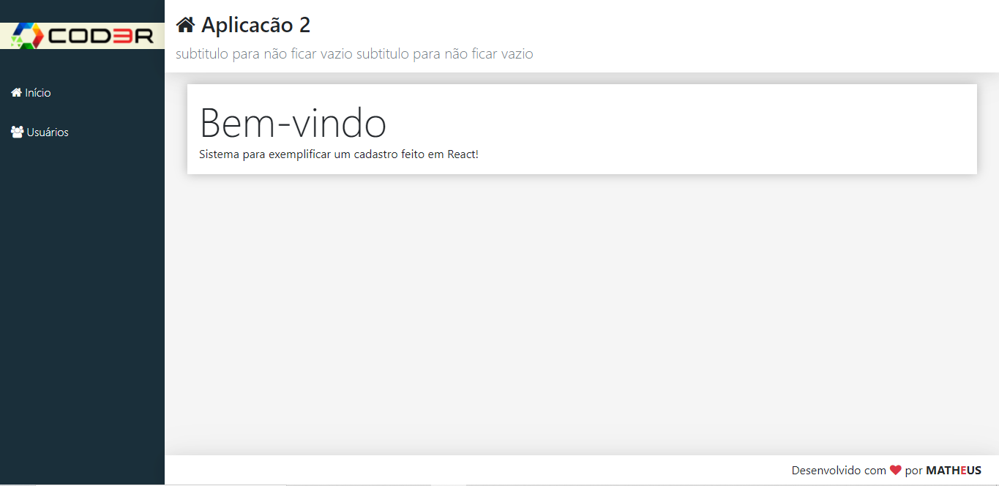

# Cadastro de usuários em react

[](https://github.com/Matheusp007-226/IMC_JS/blob/main/LICENSE) 

## 🔗 Links
[](https://veexi.com.br/)
[](https://www.linkedin.com/in/matheus-pimentel-santos/)

# Sobre o projeto

https://wmazoni-sds1.netlify.app

Uma aplicação de cadastro de usuários feito com react, utilizando componentes, rotas, props, states, jsx,etc; para o frontend e para o backend
utiliza-se o JSON server para criar dados em JSON, funcionando como uma webserver para ser consumindo no front através da api axios

Um CRUD completo via API axios

## Layout Mobile
 

## Layout Web
!

!

# Tecnologias utilizadas
## Back end
- Javascript
- JSON Server
- Axios

## Front end
- JSX / CSS / JS / Bootstrap
- ReactJS
- Apex Charts

# Como executar o projeto

## Back end
Navegar até a pasta "backend", executar e deixar rodando no local host

```bash
# clonar repositório
git clone https://github.com/Matheusp007-226/Cadastro_Usuario_React

# entrar na pasta do projeto back end
cd backend

# executar o projeto
npm start

## Front end web
Navegar até a pasta "backend", executar e deixar rodando no local host

```bash
# clonar repositório
git clone https://github.com/Matheusp007-226/Cadastro_Usuario_React

# entrar na pasta do projeto front end web
cd frontend

# executar o projeto
npm start

# Autor

Matheus Pimentel Santos de Jesus

https://www.linkedin.com/in/matheus-pimentel-961253213

